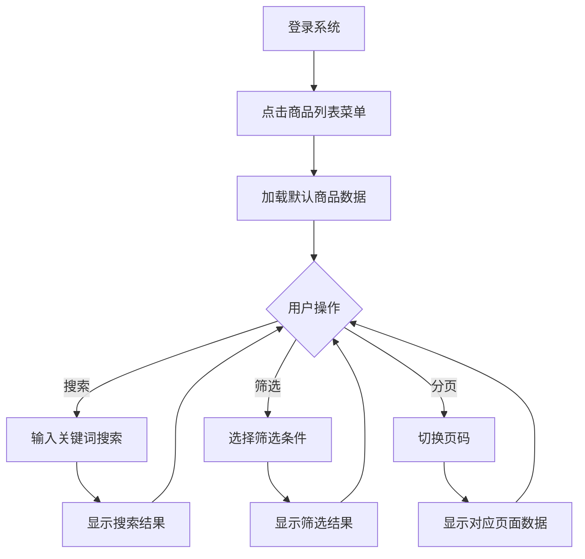

## 1. 产品概述

CS:GO商品分页查询功能旨在为Niro Control后台管理系统提供一个直观、高效的商品浏览界面。该功能允许用户查看、搜索和筛选从BUFF平台爬取的CS:GO游戏物品数据，为运营人员提供商品数据分析和管理能力。

## 2. 核心功能

### 2.1 用户角色

| 角色   | 注册方法  | 核心权限               |
| ---- | ----- | ------------------ |
| 管理员  | 系统预设  | 查看所有商品数据、使用搜索和筛选功能 |
| 运营人员 | 管理员分配 | 查看商品数据、使用搜索和筛选功能   |

### 2.2 功能模块

商品列表功能包含以下核心模块：

1. **商品列表页面**：展示所有CS:GO商品的分页数据表格
2. **搜索功能**：支持按商品名称关键词搜索
3. **筛选功能**：按商品分类、稀有度、外观品质进行筛选
4. **分页功能**：支持页码切换和每页数据量调整

### 2.3 页面详情

| 页面名称 | 模块名称 | 功能描述                              |
| ---- | ---- | --------------------------------- |
| 商品列表 | 搜索栏  | 输入关键词搜索商品名称，支持模糊匹配                |
| 商品列表 | 筛选器  | 下拉选择商品分类、稀有度、外观品质，支持多条件组合筛选       |
| 商品列表 | 数据表格 | 展示商品ID、图标、名称、市场哈希名、分类、稀有度、外观、更新时间 |
| 商品列表 | 分页控制 | 显示当前页码、总页数，支持上一页/下一页跳转和页码直接跳转     |

## 3. 核心流程

用户操作流程：

1. 用户登录系统后，在侧边栏点击"商品列表"菜单项
2. 系统加载商品列表页面，默认显示第1页数据（每页20条）
3. 用户可以通过搜索框输入关键词进行商品搜索
4. 用户可以通过筛选器选择特定条件进行数据筛选
5. 用户点击分页控件切换不同页面的数据
6. 系统实时更新表格数据展示



## 4. 用户界面设计

### 4.1 设计规范

* **主色调**：使用TDesign默认蓝色主题

* **按钮样式**：圆角矩形，主要操作为实心按钮，次要操作为线框按钮

* **字体**：系统默认字体，标题16px，正文14px，辅助文字12px

* **布局**：卡片式布局，白色背景，灰色边框

* **图标**：使用TDesign内置图标库

### 4.2 页面布局

| 模块名称 | 布局说明      | 样式描述                     |
| ---- | --------- | ------------------------ |
| 搜索栏  | 顶部横向布局    | 左侧关键词输入框（宽度300px），右侧搜索按钮 |
| 筛选器  | 搜索栏下方横向布局 | 三个下拉选择器并排显示，间距16px       |
| 数据表格 | 页面中央      | 全宽表格，表头灰色背景，行高48px，斑马纹样式 |
| 分页控件 | 表格底部      | 居中显示，包含页码按钮和每页条数选择器      |

### 4.3 响应式设计

* 桌面端优先设计，支持1280px以上屏幕

* 平板端自适应，横向滚动表格

* 移动端隐藏部分列，优先展示核心信息

## 5. 技术实现

### 5.1 前端技术栈

* Vue 3 + TypeScript + Composition API

* TDesign组件库

* TailwindCSS样式框架

* Axios网络请求

### 5.2 后端技术栈

* Spring Boot 3.x框架

* MyBatis-Plus数据访问

* PostgreSQL数据库

* 统一RESTful API规范

### 5.3 API接口设计

**接口地址**: `GET /api/goods/page`

**请求参数**:

| 参数名        | 类型     | 必填 | 说明        |
| ---------- | ------ | -- | --------- |
| pageNo     | int    | 是  | 页码，默认1    |
| pageSize   | int    | 是  | 每页条数，默认20 |
| keyword    | string | 否  | 搜索关键词     |
| categoryId | int    | 否  | 商品分类ID    |
| rarity     | string | 否  | 稀有度       |
| exterior   | string | 否  | 外观品质      |

**响应格式**:

```json
{
  "code": 200,
  "msg": "success",
  "data": {
    "records": [...],
    "total": 100,
    "pageNo": 1,
    "pageSize": 20
  }
}
```

## 6. 数据模型

### 6.1 商品数据结构

商品列表展示字段：

* id: 商品ID（主键）

* icon\_url: 商品图标URL

* name: 商品名称

* market\_hash\_name: 市场哈希名

* category: 商品分类

* rarity: 稀有度

* exterior: 外观品质

* updated\_time: 更新时间

### 6.2 数据库表结构

基于现有的`buff_goods`表，主要字段：

```sql
CREATE TABLE buff_goods (
    id BIGINT PRIMARY KEY,
    name VARCHAR(255) NOT NULL,
    market_hash_name VARCHAR(255),
    category VARCHAR(100),
    rarity VARCHAR(50),
    exterior VARCHAR(50),
    icon_url VARCHAR(500),
    updated_time TIMESTAMP DEFAULT CURRENT_TIMESTAMP
);
```

## 7. 性能要求

* 页面首次加载时间 < 2秒

* 搜索响应时间 < 500ms

* 分页切换响应时间 < 300ms

* 支持最大1000条数据的分页查询

## 8. 验收标准

* ✅ 商品列表页面正常加载，显示20条数据

* ✅ 搜索功能可按关键词过滤商品

* ✅ 筛选功能可按分类、稀有度、外观筛选

* ✅ 分页功能可正常切换页面

* ✅ 所有数据展示正确，图标正常显示

* ✅ 响应时间满足性能要求

* ✅ 界面美观，符合

