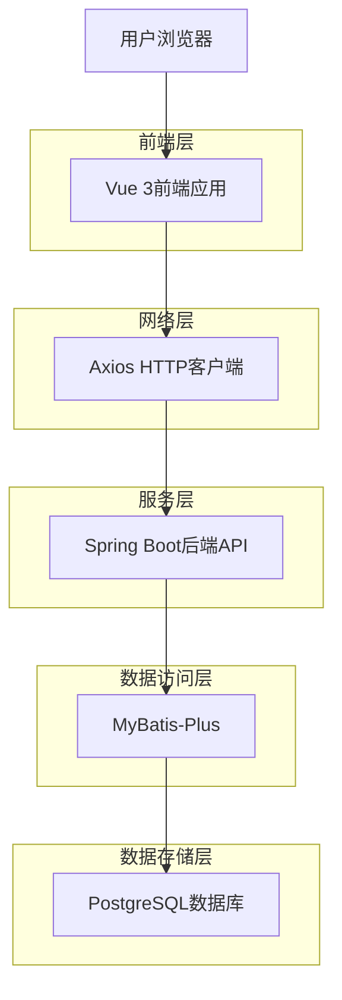
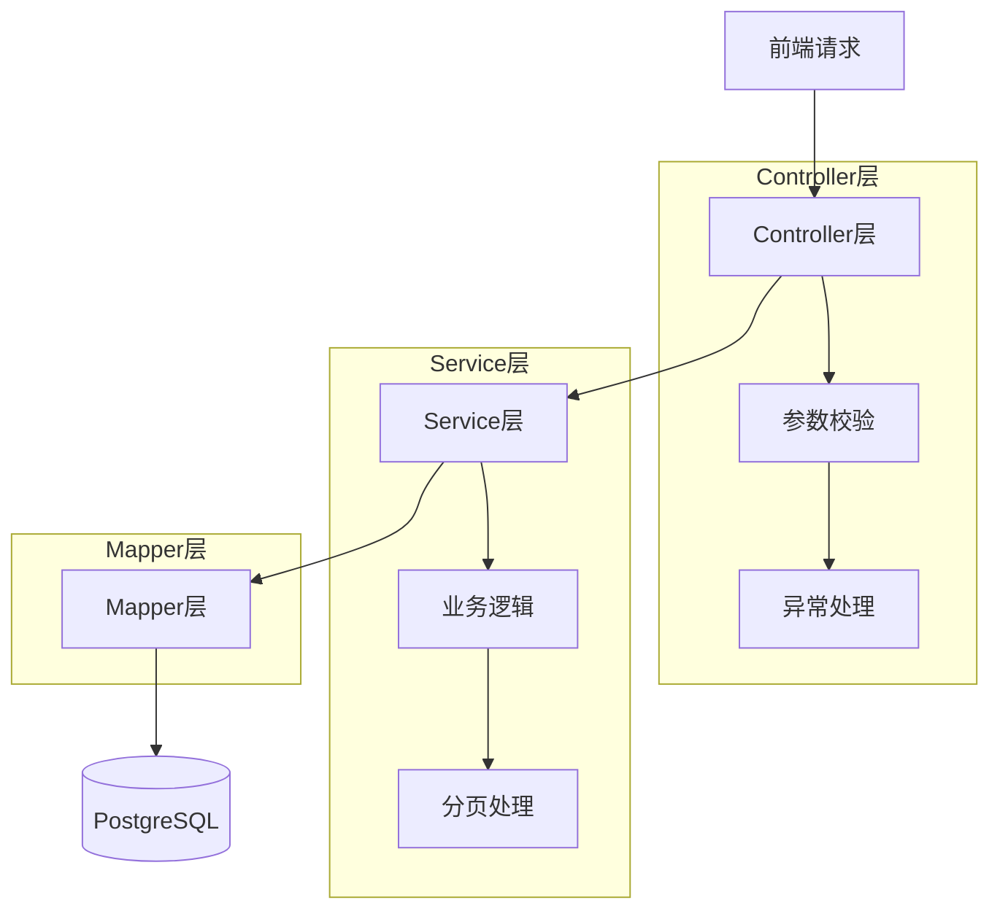
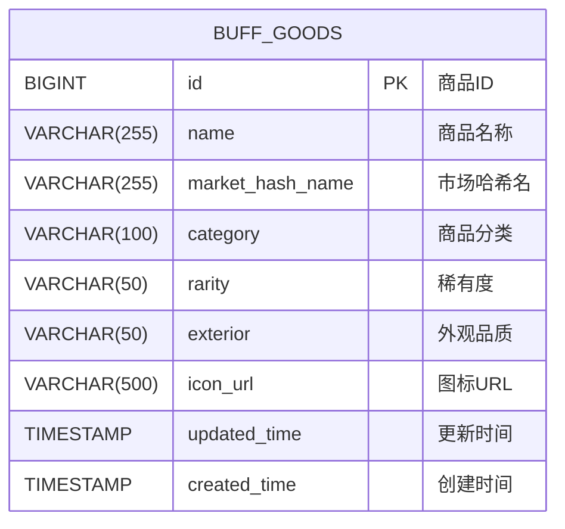

## 1. 架构设计



## 2. 技术栈描述

### 2.1 前端技术栈
- **框架**: Vue 3.4+ + TypeScript 5.x
- **UI组件库**: TDesign Vue 1.8+
- **样式框架**: TailwindCSS 3.4+
- **构建工具**: Vite 5.x
- **包管理**: pnpm 8.x
- **HTTP客户端**: Axios 1.6+
- **路由**: Vue Router 4.x

### 2.2 后端技术栈
- **框架**: Spring Boot 3.2+
- **JDK版本**: OpenJDK 21+
- **数据访问**: MyBatis-Plus 3.5+
- **数据库**: PostgreSQL 15+
- **连接池**: HikariCP 5.x
- **JSON处理**: Jackson 2.16+
- **参数校验**: Hibernate Validator 8.x

### 2.3 初始化工具
- **前端**: Vite-init (Vue 3 + TypeScript模板)
- **后端**: Spring Initializr (Spring Boot 3.x基础模板)

## 3. 路由定义

| 路由路径 | 页面组件 | 功能描述 |
|----------|----------|----------|
| `/goods` | GoodsList.vue | 商品列表主页面 |
| `/goods/list` | GoodsList.vue | 商品列表页面（默认页）|

## 4. API接口定义

### 4.1 商品分页查询接口

**接口路径**: `GET /api/goods/page`

**请求参数**:
```typescript
interface GoodsPageRequest {
  pageNo: number;      // 页码，从1开始
  pageSize: number;    // 每页条数，默认20
  keyword?: string;    // 搜索关键词，模糊匹配商品名称
  categoryId?: number; // 商品分类ID
  rarity?: string;     // 稀有度（如：普通、罕见、稀有等）
  exterior?: string;   // 外观品质（如：崭新出厂、略有磨损等）
}
```

**响应数据**:
```typescript
interface GoodsPageResponse {
  code: number;
  msg: string;
  data: {
    records: GoodsItem[];
    total: number;
    pageNo: number;
    pageSize: number;
  };
}

interface GoodsItem {
  id: number;
  name: string;
  marketHashName: string;
  category: string;
  rarity: string;
  exterior: string;
  iconUrl: string;
  updatedTime: string;
}
```

### 4.2 商品分类列表接口（辅助）

**接口路径**: `GET /api/goods/categories`

**响应数据**:
```typescript
interface CategoryResponse {
  code: number;
  msg: string;
  data: CategoryItem[];
}

interface CategoryItem {
  id: number;
  name: string;
  code: string;
}
```

## 5. 服务器架构



## 6. 数据模型

### 6.1 数据库实体关系图



### 6.2 数据表结构定义

```sql
-- 商品信息表（基于现有buff_goods表）
CREATE TABLE IF NOT EXISTS buff_goods (
    id BIGSERIAL PRIMARY KEY,
    name VARCHAR(255) NOT NULL COMMENT '商品名称',
    market_hash_name VARCHAR(255) COMMENT '市场哈希名',
    category VARCHAR(100) COMMENT '商品分类',
    rarity VARCHAR(50) COMMENT '稀有度',
    exterior VARCHAR(50) COMMENT '外观品质',
    icon_url VARCHAR(500) COMMENT '图标URL',
    created_time TIMESTAMP DEFAULT CURRENT_TIMESTAMP COMMENT '创建时间',
    updated_time TIMESTAMP DEFAULT CURRENT_TIMESTAMP COMMENT '更新时间'
);

-- 创建索引优化查询性能
CREATE INDEX idx_buff_goods_name ON buff_goods(name);
CREATE INDEX idx_buff_goods_category ON buff_goods(category);
CREATE INDEX idx_buff_goods_rarity ON buff_goods(rarity);
CREATE INDEX idx_buff_goods_exterior ON buff_goods(exterior);
CREATE INDEX idx_buff_goods_updated_time ON buff_goods(updated_time DESC);
```

### 6.3 实体类定义

```java
// Goods.java
package com.niro.web.entity;

import com.baomidou.mybatisplus.annotation.*;
import lombok.Data;
import java.time.LocalDateTime;

@Data
@TableName("buff_goods")
public class Goods {
    @TableId(type = IdType.AUTO)
    private Long id;
    
    private String name;
    
    @TableField("market_hash_name")
    private String marketHashName;
    
    private String category;
    
    private String rarity;
    
    private String exterior;
    
    @TableField("icon_url")
    private String iconUrl;
    
    @TableField("updated_time")
    private LocalDateTime updatedTime;
    
    @TableField("created_time")
    private LocalDateTime createdTime;
}
```

## 7. 前端组件架构

### 7.1 页面组件结构
```
GoodsList.vue
├── SearchBar (搜索栏组件)
├── FilterPanel (筛选面板组件)
├── GoodsTable (商品表格组件)
│   ├── TableHeader (表格头部)
│   ├── TableBody (表格主体)
│   └── TableColumn (表格列)
└── Pagination (分页组件)
```

### 7.2 状态管理
```typescript
// 使用Pinia进行状态管理
interface GoodsListState {
  loading: boolean;
  goodsList: GoodsItem[];
  total: number;
  pageNo: number;
  pageSize: number;
  keyword: string;
  categoryId: number | null;
  rarity: string;
  exterior: string;
}
```

## 8. 性能优化策略

### 8.1 前端优化
- **虚拟滚动**: 大数据量时使用虚拟滚动优化表格性能
- **防抖搜索**: 搜索输入使用防抖技术，减少请求频率
- **分页缓存**: 缓存已加载的页面数据，避免重复请求
- **图片懒加载**: 商品图标使用懒加载技术

### 8.2 后端优化
- **数据库索引**: 在常用查询字段上建立索引
- **分页查询**: 使用数据库原生分页，避免内存溢出
- **查询优化**: 避免N+1查询问题，合理使用JOIN
- **连接池**: 使用HikariCP连接池管理数据库连接

### 8.3 网络优化
- **请求合并**: 多个筛选条件合并为一次请求
- **响应压缩**: 开启GZIP压缩减少传输数据量
- **缓存策略**: 对静态资源设置合理的缓存策略

## 9. 安全考虑

### 9.1 输入验证
- **SQL注入防护**: 使用MyBatis-Plus防止SQL注入
- **XSS防护**: 对用户输入进行转义处理
- **参数校验**: 使用JSR303注解进行参数校验

### 9.2 权限控制
- **接口鉴权**: 所有API接口需要登录认证
- **数据权限**: 根据用户角色控制数据访问范围
- **操作日志**: 记录用户查询操作日志

## 10. 监控与日志

### 10.1 应用监控
- **接口响应时间**: 监控API接口响应时间
- **错误率统计**: 统计接口错误率和异常类型
- **数据库性能**: 监控SQL查询性能和慢查询

### 10.2 日志规范
- **日志级别**: DEBUG记录调试信息，INFO记录业务流程，ERROR记录系统异常
- **日志格式**: 统一JSON格式，包含traceId便于链路追踪
- **敏感信息**: 日志中不得包含用户敏感信息